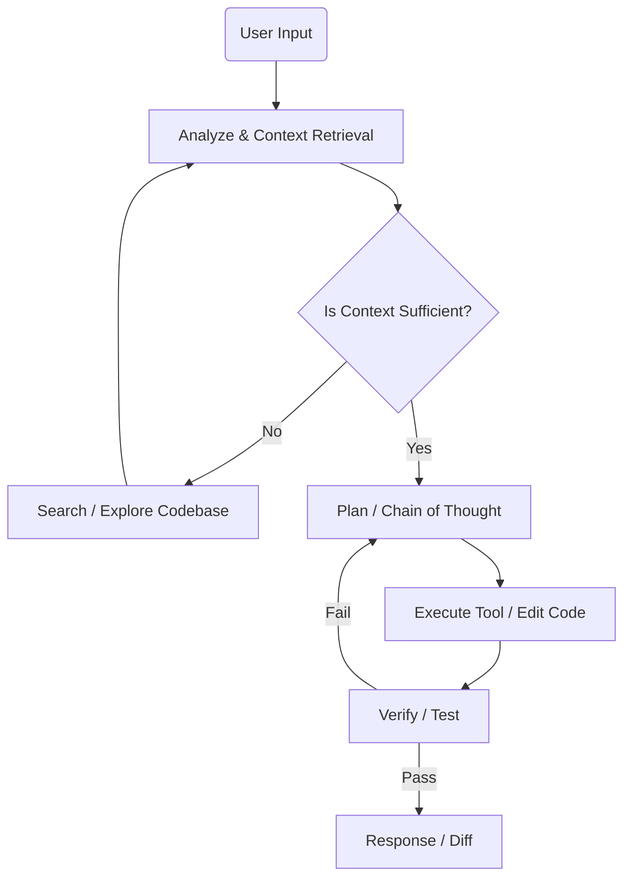

# Zene Agent Workflow

Zene's core agent workflow is a closed-loop **OODA Loop** (Observe-Orient-Decide-Act), designed to execute complex programming tasks efficiently and safely.

## 1. High-Level Flow

## 2. Detailed Steps

### Step 1: Context Retrieval (Observe)
The Agent first understands the context of the user request through static analysis.
- **Tree-sitter Analysis**: Parses the AST of relevant files to extract function signatures, struct definitions, and reference relationships.
- **Semantic Search**: (Planned) Retrieves semantically related code snippets using a vector database.
- **File Walking**: Quickly scans the project structure to locate potentially affected files.

### Step 2: Planning (Orient & Decide)
The Agent generates an execution plan based on the context.
- **Chain of Thought (CoT)**: Before executing any operation, the Agent outputs a thinking process to analyze the root cause of the problem and formulate a modification strategy.
- **Tool Selection**: Decides which tools to call (e.g., `read_file`, `write_file`, `run_command`).

### Step 3: Execution (Act)
The Agent calls tools to execute specific operations.
- **Atomic Edits**: All code modifications are submitted as atomic operations.
- **Internal Tool Calls**: Calls internal tool interfaces.
- **Dry Run**: For high-risk operations (like large-scale deletions), a Diff is generated first for user confirmation.

### Step 4: Verification (Feedback Loop)
The Agent checks the execution results.
- **Linter/Compiler Check**: Runs `cargo check` or `eslint` to verify if the code has syntax errors.
- **Test Execution**: Runs relevant unit tests to ensure functionality correctness.
- **Self-Correction**: If verification fails, the Agent reads the error logs, returns to Step 2 to correct the plan, and retries.

## 3. Agent States (State Machine)

The Agent maintains a state machine internally to manage the session lifecycle:

- **Idle**: Waiting for user input.
- **Thinking**: Performing context analysis and planning (CoT generation in progress).
- **ToolExecuting**: Waiting for tools to return results (e.g., file I/O, command execution).
- **Streaming**: Streaming the response or Diff to the client.
- **AwaitingConfirmation**: Waiting for user confirmation for sensitive operations (Human-in-the-loop).

## 4. Interaction Model

- **Request**: `{"task": "Refactor login.rs to use async-trait"}`
- **Thinking**: `{"status": "thinking", "content": "Analyzing login.rs... dependencies found in auth.rs..."}`
- **Tool Call**: `{"tool": "read_file", "path": "src/login.rs"}`
- **Tool Result**: `{"content": "..."}`
- **Action**: `{"tool": "write_file", "path": "src/login.rs", "diff": "..."}`
- **Response**: `{"status": "completed", "message": "Refactored login.rs successfully."}`
