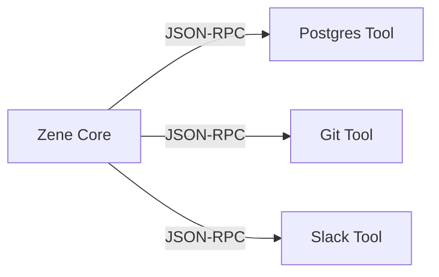

# Zene Extension Strategy

As Zene has evolved into a headless AI coding engine, its extension strategy focuses on simplicity and standard protocols.

## 1. Primary Extension Model: JSON-RPC (IPC)

Zene adopts the "Sidecar" pattern for extensibility. Instead of loading plugins into its own process memory, Zene connects to external tools via simple **JSON-RPC** over Stdio or HTTP.

### Architecture

### Why JSON-RPC?
- **Simplicity**: Easy to implement in any language (Python, TypeScript, Go, Rust).
- **Safety**: Extensions run in separate processes. A crash in a plugin cannot bring down the Zene daemon.
- **Standard**: Well-understood protocol without the complexity of heavier frameworks.

## 2. Legacy / Secondary Model: Wasm

*Note: This is now a secondary priority, reserved for high-performance, tight-loop logic customizations.*

WebAssembly (Wasm) using `wasmtime` remains a theoretical option for:
- Custom syntax highlighters.
- Lightweight logic that must run synchronously within the Zene event loop.

## 3. Tool Interface

Zene exposes its own capabilities to other agents via JSON-RPC as well.
- **`zene-server`**: Acts as a JSON-RPC Server, exposing `read_codebase`, `apply_diff`, `run_tests` tools.
