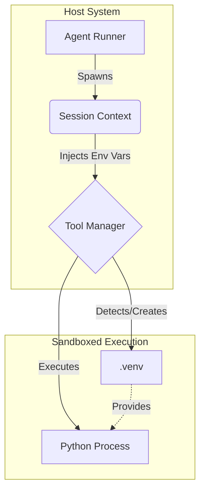

# Python Execution Environment (V3)

Zene provides a robust, isolated, and safe environment for executing Python code generated by the Agent. This system is designed to allow agents to perform data analysis, utility scripting, and complex logic verification without endangering the host system or cross-contaminating user sessions.

## Key Features

### 1. Dedicated Virtual Environment (`.venv`)
Zene automatically manages a Python virtual environment in the project root.
- **Auto-Creation**: If `.venv` does not exist, Zene creates it automatically before the first execution.
- **Performance (uv)**: Zene prioritizes using `uv` (a high-performance Python package manager) if installed, falling back to standard `python3 -m venv` otherwise. This reduces environment setup time from seconds to milliseconds.
- **Dependency Management**: When running scripts, Zene ensures dependencies (via `uv pip install` or `pip install`) are met.

### 2. Session Isolation
Each agent session is isolated to prevent data leakage between users or concurrent tasks.
- **Environment Variables**: Variables set via `set_env` are stored in the `Session` state (in-memory) and injected *only* into the child processes spawned by that specific session.
- **No Global Pollution**: The host process's environment variables are never modified, ensuring thread safety and server stability.

### 3. Safety Mechanisms
To prevent malicious or buggy code from compromising the agent runner:
- **Timeout Protection**: All scripts have a hard execution limit of **60 seconds**. Infinite loops are automatically terminated.
- **Zombie Prevention**: Standard Input (`stdin`) is explicitly closed. Scripts attempting to pause for user input (e.g., `input()`) will fail immediately instead of hanging the process.

## Available Tools

The Agent has access to the following tools to interact with this environment:

### `run_python`
Executes a Python script within the isolated `.venv`.

**Arguments:**
- `script_path` (string): Path to the `.py` file.
- `args` (array of strings, optional): Command-line arguments.

**Example:**
```json
{
  "script_path": "analysis.py",
  "args": ["--verbose"]
}
```

### `set_env`
Sets an environment variable for the current session.

**Arguments:**
- `key` (string): Variable name.
- `value` (string): Variable value.

**Example:**
```json
{
  "key": "API_KEY",
  "value": "sk-..."
}
```

### `get_env`
Retrieves the value of an environment variable from the current session context.

**Arguments:**
- `key` (string): Variable name.

## Architecture



## Best Practices for Agents

1.  **Use `set_env` for Secrets**: Never hardcode API keys in Python scripts. Use `set_env` to store them in the session, then access them via `os.environ.get()` in Python.
2.  **Dependencies**: If a script requires a library (e.g., `pandas`), the Agent should ensure it is installed or rely on the project's `requirements.txt`. Zene will attempt to install missing packages found in requirements.
3.  **Avoid Interactive Input**: Do not write scripts that use `input()` or wait for user interaction.
