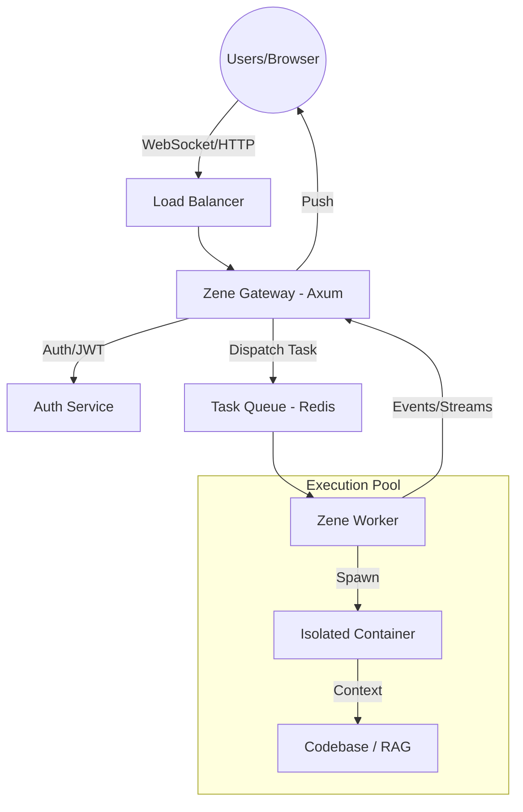

# Proposal: Multi-User Service Architecture

To evolve Zene from a local CLI/Stdio tool into a multi-user Web service, we must move beyond the `read_line` loop to a distributed, isolated, and scalable architecture.

## 1. Network Interface (Axum + WebSockets/SSE)

The Stdio-based JSON-RPC must be replaced with a modern Web server.

- **Transport**: Use `Axum` (built on `tokio`) for high-concurrency HTTP handling.
- **Async Streaming**:
    - **SSE (Server-Sent Events)**: Ideal for pushing `AgentEvent` (Thinking tokens, Tool status) in real-time.
    - **WebSockets**: Used for bidirectional interactive sessions (Human-in-the-Loop approvals).
- **Session ID Ownership**: Linked to a User ID (JWT) to prevent cross-account access.

## 2. Distributed Concurrency Model

Currently, Zene runs in a single process. For multi-user, we use a **Gateway/Worker** separation.

### Gateway Node
- Handles Authentication, Session Management, and API routing.
- Maintains a **Connection Registry** to route messages.

### Worker Nodes (The Runtime)
- Each task execution runs on a worker node.
- **DashMap instead of Mutex**: `SessionManager` should use concurrent structures to prevent global locking.

## 3. Environment Isolation (The "Sandbox" Problem)

In a multi-user environment, running `sh` or `python` on the host is unacceptable.

- **Option A: Ephemeral Containers (Recommended)**:
  - Spawns lightweight **Docker/Podman containers** for tasks.
  - Project codebase is mounted as a volume.
- **Option B: WebAssembly (Wasm) Runtime**: Highly secure, but limited for complex toolchains.

## 4. Scalable Persistence
- **Session Store**: PostgreSQL or MongoDB for distributed access.
- **Memory (RAG)**: Managed vector service (e.g., Qdrant, Milvus).

## 5. Resource Budgeting (QoS)
- **Token Quotas**: Hard limits per user.
- **Concurrency Limits**: Max active agents per user.
- **CPU/Memory Capping**: Enforced via cgroups/Docker.

## 6. Proposed Architecture Diagram

