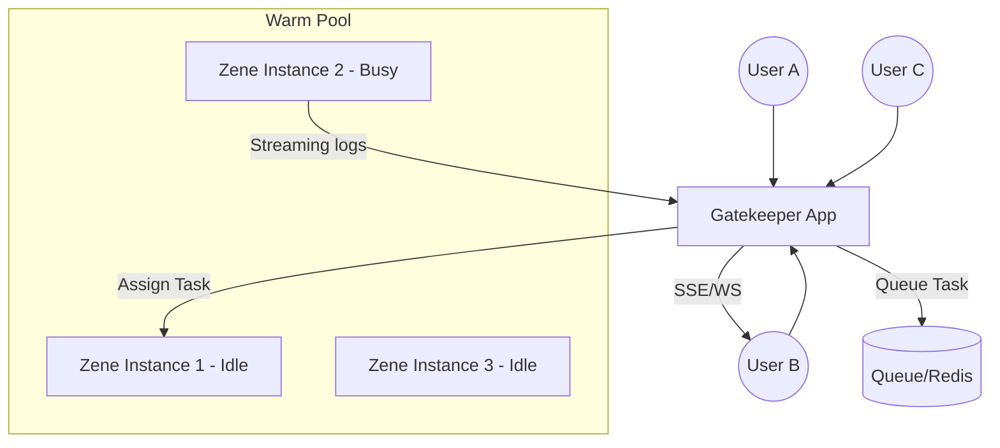

# Design: Zene Warm Pool Orchestration

The "Warm Pool" model strikes a balance between single-process isolation and the performance of a long-running server.

## 1. Context & Architecture

## 2. Gatekeeper Responsibilities

### A. Lifecycle Management
- **Pre-warming**: Gatekeeper launches $N$ instances of `zene server --stdio`. 
- **Health Checks**: Gatekeeper kills hangs and spawns replacements.
- **Scaling**: Dynamically adjust $N$.

### B. Task Queueing
- Requests are queued when all instances are `Busy`.

### C. State Reset (The "Cleaning" Protocol)
1. **Command**: Gatekeeper sends `system.reset` RPC.
2. **Action**: Zene clears conversation, resets envs, and flushes cache.

## 3. Communication Flow (JSON-RPC over Stdio)

1. **Gatekeeper -> Zene**: `agent.run`
2. **Zene -> Gatekeeper**: Streaming events.
3. **Zene -> Gatekeeper**: Result object.
4. **Gatekeeper -> Zene**: `session.reset`

## 4. Benefits
- **Complexity Shift**: Concurrency handled by Gatekeeper.
- **Zene Simplicity**: Zene remains single-threaded.
- **Performance**: Zero startup delay.

## 5. Security Note: Filesystem Isolation
While the *process* is warm, it still shares the physical filesystem. We recommend using separate directories per user and passing `cwd` to Zene.
