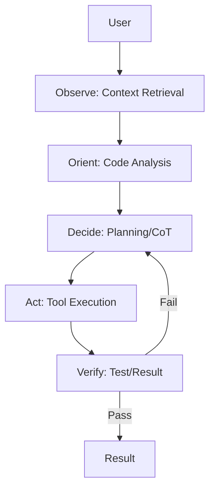

# Architecture

Zene is a high-performance, headless AI coding engine designed for precision, speed, and safety. It follows a recursive **Plan-Execute-Reflect** loop, inspired by autonomous agent research and the OODA loop.

## 1. Core Philosophy
- **Headless & Protocol-First**: Decoupled core communicating via JSON-RPC.
- **Asynchronous & Concurrent**: Built on `tokio` for massive parallelism in tool execution.
- **Session Isolation**: No shared global state; environment and history are scoped to individual sessions.

## 2. Agent Workflow (OODA Loop)
Zene follows an **Observe-Orient-Decide-Act** loop to solve tasks.

### The Steps:
1. **Observe**: Analyze the project structure and semantically retrieve relevant code (RAG).
2. **Orient**: Use `tree-sitter` to build a mental map of definitions and dependencies.
3. **Decide**: Formulate an atomic plan using Chain of Thought.
4. **Act**: Execute tools (Edit, Shell, Python) in isolated child processes.
5. **Verify**: Self-correct by checking compiler output and running tests.

## 3. Technical Architecture

### Module Structure
- `src/agent/`: The Brain. Orchestration, LLM interactions, and Planning.
- `src/engine/`: The Hands. Context management, Session storage, Tool implementation.
- `src/api/`: The Voice. JSON-RPC protocol and CLI/Server interfaces.

### Concurrency & Isolation
Zene avoids global state. All mutable data (environment variables, session history) is wrapped in `Arc<Mutex<Session>>`.
- **Environment Management**: Variables are injected only at the child process level, preventing "Environment Pollution" in the main server.
- **Safe Parallelism**: Independent tools are executed concurrently using `join_all`.

## 4. Operational Modes
- **One-Shot CLI**: Transient execution for quick terminal tasks.
- **Long-Running Server**: Stdio/Socket-based daemon for IDE integrations.

## 5. Observability (xtrace)
Automated tracing is baked into the architecture:
- **Trace ID Propagation**: `X-Trace-Id` headers and `ZENE_TRACE_ID` environment variables link all tool activity back to the original task trace.
- **Automated Metrics**: Token usage and span durations are captured per session without manual boilerplate.
