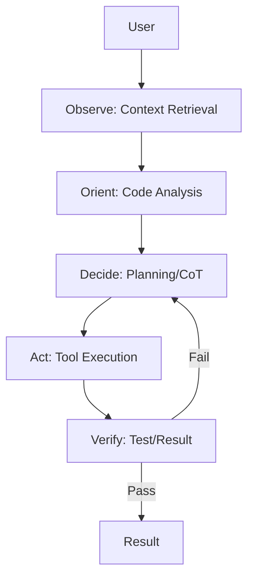

# Architecture

Zene is a high-performance, embeddable agent execution engine designed for precision, speed, and control. Its architecture is divided into clear layers, from the high-level host interaction down to the low-level infrastructure.

## 1. Core Philosophy
- **Embeddable Runtime**: Zene should work in-process or behind a thin worker process.
- **Asynchronous & Concurrent**: Built on `tokio` for massive parallelism in tool execution.
- **Session Isolation**: Environment and history are scoped to individual runs and sessions.

## 2. Agent Workflow (OODA Loop)
Zene follows an **Observe-Orient-Decide-Act** loop to solve tasks.

### The Steps:
1. **Observe**: Analyze the project structure and semantically retrieve relevant code (RAG).
2. **Orient**: Use `tree-sitter` to build a mental map of definitions and dependencies.
3. **Decide**: Formulate an atomic plan using **[Plan-Execute-Reflect (P3)](/guide/optimization)**.
4. **Act**: Execute tools (Edit, Shell, **[Python](/guide/python)**) in isolated child processes.
5. **Verify**: Self-correct by checking compiler output and running tests.

## 3. Technical Architecture

### Module Structure
- `src/agent/`: Strategy-facing coordination, LLM interactions, planning, reflection, and execution loops.
- `src/engine/`: Runtime contracts, run lifecycle, context management, session storage, and tool implementation.
- `src/main.rs`: Thin host-facing CLI entrypoints, including one-shot CLI and worker mode.

### Runtime Lifecycle

Zene now models one execution as a tracked run with explicit runtime state.

- `RunRequest`: Host input, including prompt, session id, environment, and optional strategy.
- `RunHandle`: Host-visible handle returned by `submit` for streaming and later inspection.
- `RunSnapshot`: Snapshot of run status, timestamps, output, and terminal error state.
- `RunStatus`: `Pending`, `Running`, `WaitingTool`, `WaitingApproval`, `Completed`, `Failed`, or `Cancelled`.

This gives hosts a stable execution contract regardless of whether they embed Zene directly or run it behind a worker process.

### Strategy Boundary

Zene currently exposes explicit execution strategies:

- `Planned`: Create or reuse a plan, then execute and reflect over planned tasks.
- `Direct`: Skip planning and execute the request as a direct task.

The important boundary is:

- strategy objects decide flow
- the orchestrator exposes reusable execution helpers
- the executor and tool manager perform the actual work

### Concurrency & Isolation
Zene avoids global state. All mutable data (environment variables, session history) is wrapped in `Arc<Mutex<Session>>`.
- **Environment Management**: Variables are injected only at the child process level, preventing "Environment Pollution" in the main server.
- **Safe Parallelism**: Independent tools are executed concurrently using `join_all`.

## 4. Operational Modes
- **One-Shot CLI**: Transient execution for quick terminal tasks.
- **Worker Process**: Spawn-per-request JSON input and JSONL event output for host integrations.
- **Embedded Runtime**: Direct host calls through `ZeneEngine`, including streaming, run tracking, and cooperative cancellation.

## 5. Observability (xtrace)
Automated tracing is baked into the architecture:
- **Trace ID Propagation**: `X-Trace-Id` headers and `ZENE_TRACE_ID` environment variables link all tool activity back to the original task trace.
- **Automated Metrics**: Token usage and span durations are captured per session without manual boilerplate.

## 6. Kernel Boundary

As Zene evolves, the architecture should treat orchestration patterns as replaceable strategies rather than as engine truths.

- **Execution Kernel**: Owns runtime state, tool calls, events, persistence, and failure semantics.
- **Decision Strategy**: Owns plan-first, direct execution, routing, evaluator loops, and other orchestration choices.
- **Product Policy**: Chooses which strategy to use for a given surface or workload.

The current refactor direction is already visible in the codebase:

- the runtime owns run lifecycle and cancellation
- worker mode is a thin transport around the runtime
- strategies choose between planned and direct execution
- orchestrator methods are being reduced to reusable execution helpers

For a deeper design note, see [Execution Kernel vs Strategy](/guide/design/execution-kernel).
