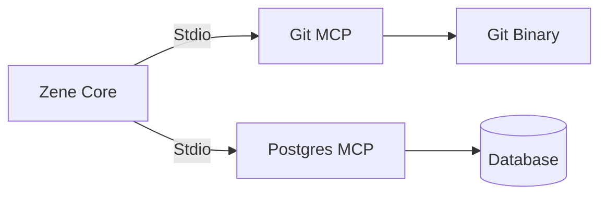

# MCP Integration

Zene is designed to be highly extensible through the **Model Context Protocol (MCP)** and modular tool definitions.

## 1. Model Context Protocol (MCP)
Zene adopts MCP as the standard for interacting with external resources and tools.

- **Ecosystem Compatibility**: Use any existing MCP server (Git, Postgres, Google Search) without custom glue code.
- **Standardization**: MCP defines clear schemas for Tools, Resources, and Prompts.
- **Isolation**: MCP servers run as independent processes (Stdio/HTTP), keeping Zene's core stable.

### MCP Architecture
Zene acts as an **MCP Client** connecting to multiple **MCP Servers** (Sidecars).



## 2. Extension Points
Beyond MCP, Zene can be extended internally:

- **Custom Tools**: Add new capabilities by defining tools in `src/engine/tools.rs` and registering them in the `ToolManager`.
- **New Agent Types**: Modify the `Orchestrator` or add specialized logic for different reasoning patterns.
- **Custom Persistence**: Implement the `SessionStore` trait to support new storage backends (e.g., S3, Redis).

## 3. Adding New Functionality
1. **Identify the Point**: Decide if it's a stand-alone MCP server or a core Zene tool.
2. **Implement**: Adhere to the `ZeneError` system and async patterns.
3. **Configure**: Add MCP servers to `zene_config.toml`:
   ```toml
   [mcp_servers]
   git = { command = "uvx", args = ["mcp-server-git"] }
   ```
4. **Verify**: Use the integration test suite to ensure the new capability is reachable by the Agent.
